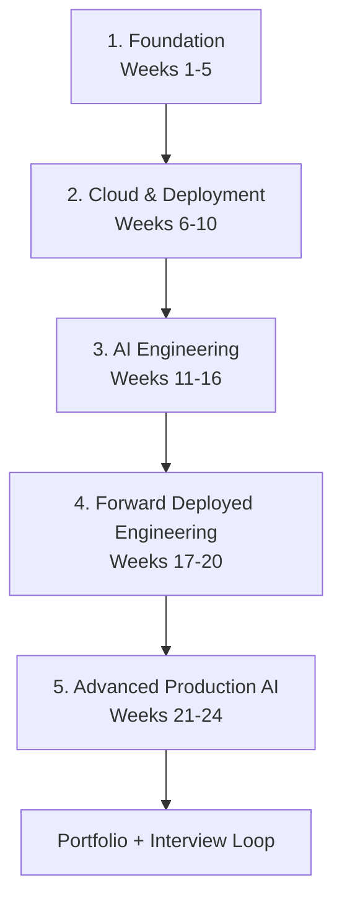
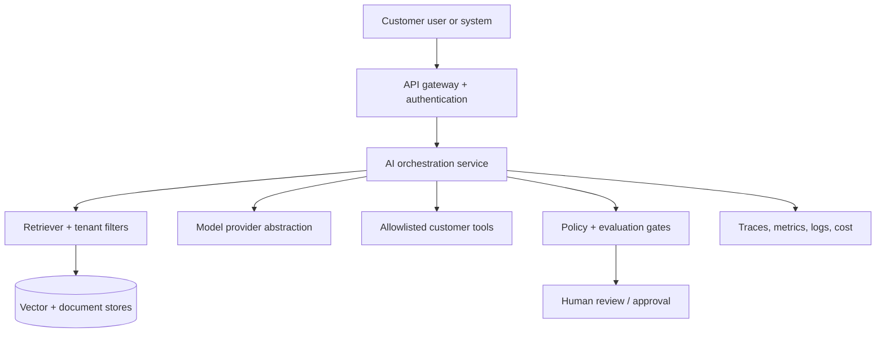

# QE to Forward Deployed AI Engineer

[](https://github.com/ashokmanohar-ai/-qe-to-forward-deployed-ai-engineer/actions/workflows/quality.yml)
[](https://www.python.org/)
[](LICENSE)
[](ROADMAP.md)

> A practical, evidence-based transition path for Quality Engineers becoming Forward Deployed Engineers in AI.

This is not a link collection. It is a **24-week build system** containing guided lessons, hands-on labs, customer simulations, debugging incidents, production infrastructure, an interactive progress tracker, portfolio briefs, and an interview loop. Every stage turns an existing Quality Engineering strength into a demonstrable Forward Deployed Engineering capability.

## 📄 Technical White Paper

**[The AI Quality Engineer: Skills, Architecture Patterns and Operating Model for the Agentic AI Era](WHITEPAPER.md)**

A profession-level synthesis of evidence-driven AI Quality Engineering across deterministic software testing, LLM and RAG evaluation, agent trajectories, prompt regression, MCP/tool quality, identity and authorization, human approval, AI security, observability, performance and cost, CI/CD quality gates and production learning.

> **Core principle:** the AI Quality Engineer exists to make AI-enabled software releasable for reasons that can be explained, reproduced and defended—not because a model appeared impressive in a demo.

Citation metadata is available in [`CITATION.cff`](CITATION.cff), with the publication index in [`publications/README.md`](publications/README.md).

## What you will be able to do

By the end, you should be able to:

- discover a customer's real problem and define measurable success;
- build typed Python services and integrate REST APIs, databases, and data pipelines;
- design RAG and tool-calling systems with explicit quality and safety boundaries;
- evaluate non-deterministic AI behavior using datasets, metrics, traces, and human review;
- package and deploy an AI service with Docker, Kubernetes, CI/CD, and Terraform;
- secure authentication, secrets, tenant data, tools, and delivery pipelines;
- investigate production failures and explain trade-offs to technical and business stakeholders;
- present a credible portfolio with architecture decisions, evidence, and operational runbooks.

## The QE advantage

You are not starting over. A strong QE already thinks in contracts, edge cases, failure modes, evidence, and customer impact.

| Existing QE strength | FDE (AI) application | Skill to add |
|---|---|---|
| Test automation | Build repeatable integrations and delivery workflows | Production Python and maintainable application design |
| API testing | Integrate customer systems and validate contracts | API ownership, async work, resilience, and versioning |
| Root-cause analysis | Diagnose retrieval, model, tool, data, and infrastructure failures | Distributed tracing, cloud logs, and incident command |
| Risk-based testing | Prioritize AI evals, guardrails, and rollout gates | Threat modeling and AI-specific evaluation |
| CI/CD experience | Create build, test, security, and deployment pipelines | Containers, Kubernetes, IaC, and release strategies |
| Product behavior knowledge | Translate workflows into useful AI solutions | Discovery, value framing, and solution architecture |
| Regression discipline | Detect quality drift and prevent production regressions | Offline/online evals, telemetry, and feedback loops |

Read the full [QE-to-FDE skill bridge](docs/skill-bridge.md) and complete the baseline assessment before Week 1.

## The learning system



Each week follows the same evidence loop:

1. **Learn** the minimum concepts.
2. **Build** a working increment.
3. **Break** it with a deliberate failure.
4. **Measure** quality, reliability, latency, or cost.
5. **Explain** the decision as if speaking to a customer.
6. **Record evidence** in a commit, issue, ADR, runbook, trace, test report, or demo.

Recommended pace: **8-10 focused hours per week**. The roadmap is outcome-based; extend a week when its exit evidence is not yet convincing.

## 24-week roadmap

| Week | Stage | Outcome | Evidence |
|---:|---|---|---|
| 1 | Foundation | Write typed, tested Python | CLI and unit tests |
| 2 | Foundation | Operate Git, Linux, networking, and processes | Debugging journal |
| 3 | Foundation | Query and model relational data | SQL investigation |
| 4 | Foundation | Build and consume resilient REST APIs | FastAPI service |
| 5 | Foundation | Apply clean architecture and system-design basics | ADR + diagram |
| 6 | Cloud | Containerize securely | Docker image + scan |
| 7 | Cloud | Deploy and debug Kubernetes workloads | Manifests + runbook |
| 8 | Cloud | Build CI/CD quality and release gates | GitHub Actions pipeline |
| 9 | Cloud | Map architectures across AWS, Azure, and GCP | Cloud decision record |
| 10 | Cloud | Provision and observe infrastructure | Terraform + telemetry |
| 11 | AI | Explain LLM behavior, limits, tokens, and inference | Model experiment report |
| 12 | AI | Design structured, testable prompts | Prompt contract suite |
| 13 | AI | Use embeddings and vector search | Retrieval benchmark |
| 14 | AI | Build and evaluate a grounded RAG flow | RAG assistant |
| 15 | AI | Build bounded tool-calling agents | Agent trace + safety tests |
| 16 | AI | Create an LLM evaluation strategy | Evaluation harness |
| 17 | FDE | Run discovery and define success | Discovery brief |
| 18 | FDE | Design customer integrations and AI architecture | Solution proposal |
| 19 | FDE | Deliver a rapid prototype and production plan | Prototype demo |
| 20 | FDE | Lead incident diagnosis and customer communication | Incident review |
| 21 | Production AI | Secure identity, secrets, data, models, and tools | Threat model |
| 22 | Production AI | Engineer reliability, observability, and performance | SLO dashboard |
| 23 | Production AI | Scale while controlling quality and cost | Load/cost report |
| 24 | Production AI | Complete the customer capstone and interview loop | Portfolio release |

The detailed requirements and checkboxes live in [ROADMAP.md](ROADMAP.md). Machine-readable module data is in [curriculum.json](curriculum.json).

## Start in five minutes

### 1. Clone and install

```bash
git clone https://github.com/ashokmanohar-ai/-qe-to-forward-deployed-ai-engineer.git
cd -- -qe-to-forward-deployed-ai-engineer
python -m venv .venv
source .venv/bin/activate          # Windows: .venv\Scripts\activate
python -m pip install -e ".[dev]"
```

The `cd --` form is needed only while the repository name begins with `-`. Renaming it to `qe-to-forward-deployed-ai-engineer` removes that special case.

### 2. Run the interactive tracker

```bash
fde-roadmap overview
fde-roadmap next
fde-roadmap start 1
fde-roadmap complete 1 --evidence "https://github.com/<you>/<repo>/pull/1"
fde-roadmap status
```

Progress is stored locally in `.fde-progress.json`, which is ignored by Git. Use [GitHub Discussions or the weekly issue form](.github/ISSUE_TEMPLATE/weekly-progress.yml) for public accountability.

### 3. Run the reference AI service

```bash
cp .env.example .env
docker compose up --build
curl http://localhost:8000/health
```

The reference service is deliberately provider-neutral and works without paid model access. It demonstrates deterministic retrieval, citations, bounded tool execution, evaluation, authentication, metrics, and trace IDs. Replace the deterministic generator with your chosen hosted or local model during the AI Engineering stage.

### 4. Verify your environment

```bash
make check
make test
make docs
```

## Repository map

```text
.
├── docs/                 # Rendered learning site and deep-dive tutorials
├── labs/                 # Eight guided labs with failures and solutions
├── projects/             # Eight portfolio project briefs and rubrics
├── src/qe_fde/           # Progress CLI and reference AI service
├── tests/                # Unit, API, security, and repository checks
├── infra/                # Docker, Kubernetes, and Terraform examples
├── scripts/              # Link and curriculum validation
├── curriculum.json       # Machine-readable 24-week plan
└── ROADMAP.md            # Human-friendly progress checklist
```

## Hands-on labs

| Lab | Practice | Failure you must diagnose |
|---|---|---|
| [1. Python API debugging](labs/01-python-api-debugging/README.md) | Types, tests, retries, contracts | Incorrect retry and error handling |
| [2. REST service](labs/02-rest-service/README.md) | FastAPI, validation, auth, idempotency | Duplicate customer request |
| [3. SQL data pipeline](labs/03-sql-data-pipeline/README.md) | Schema, joins, quality gates | Silent duplicate ingestion |
| [4. Container debugging](labs/04-container-debugging/README.md) | Docker, Kubernetes, probes | CrashLoopBackOff and bad health check |
| [5. RAG quality](labs/05-rag-quality/README.md) | Chunking, retrieval, citations, evals | Wrong-tenant retrieval |
| [6. Agent tool calling](labs/06-agent-tool-calling/README.md) | Schemas, allowlists, approvals | Duplicate side effect |
| [7. Observability and evaluation](labs/07-observability-evaluation/README.md) | Traces, metrics, datasets, gates | Quality regression hidden by averages |
| [8. Production incident](labs/08-production-incident/README.md) | Triage, mitigation, RCA, communication | Latency and cost spike |

## Portfolio projects

Each project has an MVP, production-hardening path, acceptance criteria, QE leverage, and interview narrative.

1. [RAG-based AI assistant](projects/01-rag-assistant/README.md)
2. [AI customer-support application](projects/02-customer-support-ai/README.md)
3. [LLM evaluation framework](projects/03-llm-evaluation-framework/README.md)
4. [API and external-tool agent](projects/04-api-tool-agent/README.md)
5. [Docker and Kubernetes AI deployment](projects/05-kubernetes-deployment/README.md)
6. [LLM observability dashboard](projects/06-llm-observability-dashboard/README.md)
7. [Production-ready authenticated AI service](projects/07-production-ai-service/README.md)
8. [Customer capstone: discover, design, build, deploy, and hand over](projects/08-customer-capstone/README.md)

Do not build eight shallow demos. Complete Projects 1, 3, and 8 deeply; use the others to target gaps or a specific role description.

## Reference architecture



Study the [architecture decisions and failure boundaries](docs/reference/architecture.md) before implementing the capstone.

## Customer practice

The [customer scenario pack](docs/scenarios/customer-scenarios.md) includes:

- a regulated customer-support assistant with PII and escalation requirements;
- a multi-tenant technical-documentation RAG service;
- a supply-chain exception agent that can call transactional APIs;
- an AI test-design platform requiring traceability, evaluation, and governance.

For each scenario, you will run discovery, define success metrics, propose an architecture, inject failures, make a rollout plan, and deliver an executive explanation.

## Interview preparation

The [complete FDE (AI) interview roadmap](docs/interview/roadmap.md) covers:

- Python and practical coding;
- API and data-integration exercises;
- AI/LLM, RAG, agents, evaluation, and safety;
- system design, cloud infrastructure, and deployment;
- live debugging and incident investigation;
- customer discovery, ambiguity, objections, and trade-off communication;
- a six-week practice schedule with scoring rubrics.

## Quality standard

Every portfolio claim should be backed by evidence. A project is not complete because it produces one good answer. It is complete when another engineer can run it, test it, observe it, understand its risks, and recover it from failure.

Minimum release evidence:

- reproducible setup and architecture diagram;
- automated tests and a documented evaluation dataset;
- security and privacy assumptions;
- latency, quality, reliability, and cost targets;
- CI checks and deployment instructions;
- runbook, rollback plan, and known limitations;
- short customer-facing demo and technical deep dive.

## Contributing

Improvements are welcome. Read [CONTRIBUTING.md](CONTRIBUTING.md), follow the [Code of Conduct](CODE_OF_CONDUCT.md), and report vulnerabilities through [SECURITY.md](SECURITY.md).

## License

Released under the [MIT License](LICENSE). Learning resources linked from this repository retain their respective licenses.
