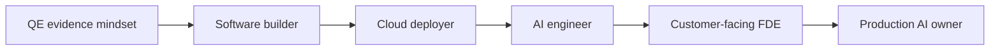

# From Quality Engineer to Forward Deployed AI Engineer

This learning system uses your QE experience as an accelerator. You will keep the habits that make quality engineers valuable—evidence, contracts, failure analysis, automation, product understanding, and risk thinking—while adding the software, cloud, AI, deployment, and customer-delivery depth expected of an FDE.

## The target role

A Forward Deployed AI Engineer works close to a customer and close to production. The role combines five modes:

| Mode | Core question | Typical output |
|---|---|---|
| Discover | What problem is actually worth solving? | Discovery brief and success measures |
| Design | What is the smallest credible system? | Architecture, contracts, ADRs, risk register |
| Build | Can we prove value with a vertical slice? | Working service, integration, and evaluation |
| Deploy | Can the customer operate this safely? | Infrastructure, CI/CD, security, telemetry, runbook |
| Improve | What failed, changed, or should scale next? | Incident review, eval trends, roadmap, cost plan |

## What makes this roadmap different

- **Evidence over completion:** every week ends with inspectable proof.
- **Failure before confidence:** labs deliberately break software, retrieval, tools, and infrastructure.
- **Customer context:** technical work is tied to workflows, constraints, owners, and value.
- **AI quality as a system property:** model output is only one part of the evaluation boundary.
- **Production realism:** authentication, tenant isolation, observability, cost, rollback, and handover are never optional after the prototype stage.

## Choose your next action

- New to the repository: [set up your environment](getting-started.md).
- Unsure what transfers from QE: complete the [skill bridge and baseline assessment](skill-bridge.md).
- Ready to plan: review the [24-week roadmap](roadmap.md).
- Ready to build: start with the [hands-on labs](labs/index.md).
- Preparing a portfolio: use the [project briefs and evidence rubric](projects/index.md).
- Preparing for a role: follow the [interview roadmap](interview/roadmap.md).

!!! tip "Optimize for a credible story"
    One deeply evaluated, deployed, and documented customer solution is worth more than many disconnected notebooks. Use every lab to strengthen the final capstone.

