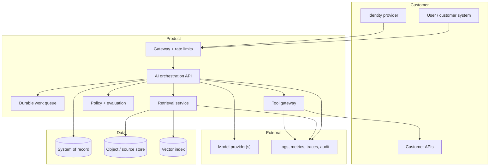
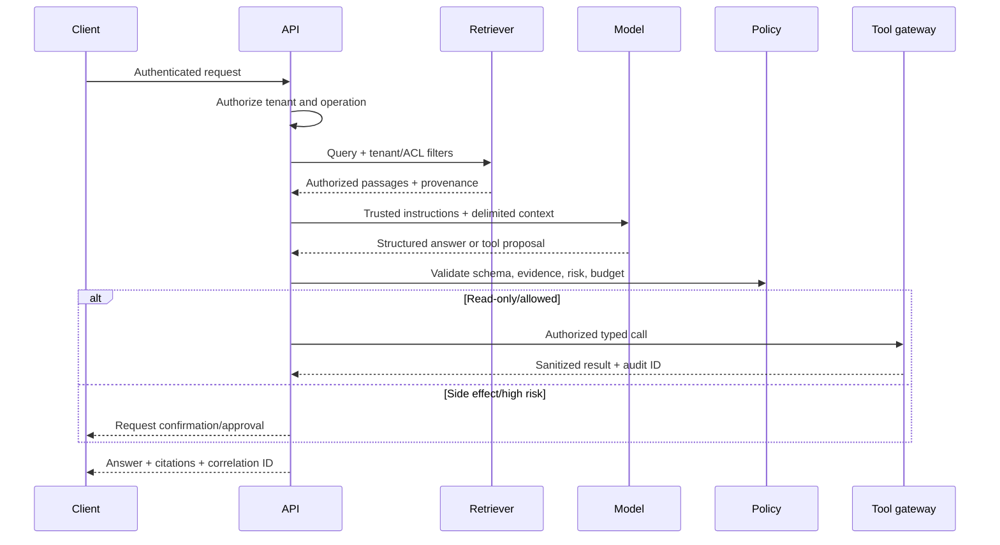

# Reference production AI architecture

The repository implementation is intentionally local and small. This reference explains how its boundaries evolve for production.

## Logical architecture



## Authority model

- Identity and authorization come from trusted identity/application policy, never model output.
- Tenant/ACL constraints are resolved before retrieval and rechecked at data boundaries.
- Retrieved content and tool output are untrusted data.
- Tools receive the least privileged user/service identity they require.
- Side effects require explicit policy, idempotency, limits, audit, and approval according to risk.
- Models can propose; application code validates and authorizes.

## Request sequence



## Failure matrix

| Dependency/failure | User behavior | Engineering response | Evidence |
|---|---|---|---|
| Identity unavailable | fail closed or use safe cached session policy | circuit breaker, no anonymous fallback | auth error metric and trace |
| Source/index stale | disclose/abstain for freshness-sensitive task | freshness SLI, re-index queue, owner alert | source version and timestamp |
| Vector store slow | bounded timeout and safe fallback | degrade retrieval mode or abstain | retrieval span and saturation |
| Model rate-limited | queue/retry within budget or route approved fallback | backoff, quotas, provider routing | attempt, provider, model, cost |
| Invalid model output | reject/repair once or fail safely | schema/policy validation | raw safe metadata and error code |
| Tool timeout | do not assume failure; reconcile by idempotency key | status lookup, bounded retry | tool request/audit identity |
| Partial deployment | retain previous healthy version | canary gate and rollback | deployment annotations |
| Eval regression | block rollout or reduce exposure | segment gate and investigation | dataset/run/config versions |

## Data lifecycle

For each class—source documents, embeddings, prompts, conversations, feedback, eval datasets, traces, and audit—define owner, purpose, classification, region, encryption, access, retention, deletion, backup/restore, and derived-data cleanup.

Deleting a document row is incomplete if chunks, embeddings, caches, eval samples, and backups remain without a defined lifecycle.

## Architecture decision records

Create an ADR for decisions with meaningful alternatives or future cost:

```markdown
# ADR-NNN: Decision title

Status: proposed | accepted | superseded
Date: YYYY-MM-DD
Owners: ...

## Context and customer constraints
## Decision
## Alternatives considered
## Consequences and trade-offs
## Security, quality, operations, and cost impact
## Validation and reversal trigger
```

Recommended ADRs: model/provider, retrieval/index, tenant enforcement, sync/async workflow, tool authorization, observability/redaction, deployment platform, and evaluator strategy.

## Production readiness questions

- Can every response be traced to code, configuration, prompt, model, index, source, tool, and deployment versions?
- Can a customer delete data and all governed derivatives?
- Can an operator distinguish source, retrieval, model, policy, tool, and infrastructure failures?
- Can the service degrade without inventing certainty or unsafe action?
- Can a release be blocked by a critical segment despite aggregate improvement?
- Can a side effect be reconciled after an ambiguous timeout?
- Are SLOs and cost tied to successful customer tasks?

