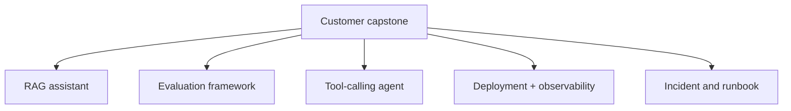

# Roadmap overview

The roadmap is organized around five production capabilities, not tool completion.

| Stage | Weeks | You enter with | You exit able to |
|---|---:|---|---|
| Foundation | 1-5 | QE automation and debugging experience | Build and reason about a typed Python API and its data |
| Cloud and Deployment | 6-10 | Working local service | Package, deploy, observe, and reproduce it as code |
| AI Engineering | 11-16 | Reliable software/deployment base | Build grounded RAG and bounded agent systems with evals |
| Forward Deployed Engineering | 17-20 | AI engineering capability | Discover and deliver a customer solution under uncertainty |
| Advanced Production AI | 21-24 | Working customer prototype | Defend security, reliability, scale, cost, and operations |

## Exit reviews

At the end of each stage, ask another engineer to review evidence using four questions:

1. **Correctness:** does it meet the stated contract and evaluation threshold?
2. **Failure:** what happens when dependencies, data, models, tools, or operators fail?
3. **Operations:** can someone deploy, observe, recover, and change it safely?
4. **Customer value:** what measurable workflow outcome does it improve?

If an answer relies on “it should,” create an experiment or test.

## Portfolio strategy

Use a spine-and-branches approach:

The branch projects can become reusable components of the capstone. This creates one coherent story and avoids eight unrelated demos.

## Weekly operating rhythm

| Session | Time | Activity |
|---|---:|---|
| Concept | 1.5 h | Read primary documentation and capture questions |
| Guided build | 2 h | Follow the tutorial and verify each checkpoint |
| Independent build | 3 h | Apply it to the capstone domain |
| Failure drill | 1 h | Inject one realistic failure and investigate |
| Evidence | 1 h | Tests, metrics, diagram, ADR, runbook, or demo |
| Explanation | 0.5 h | Record a customer-level and engineer-level summary |

The detailed checkbox version is available in the repository's `ROADMAP.md`, and the CLI reads `curriculum.json`.

