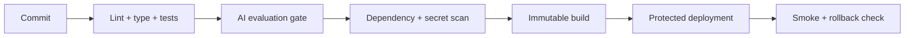

# Stage 2 — Cloud and Deployment

**Weeks 6-10 · Exit outcome:** ship the Stage 1 service through CI into a reproducible container and Kubernetes environment managed as code.

## Week 6: Build a secure container

Start from the repository `Dockerfile` and inspect each decision.

1. Pin the language family and record the resolved digest for a release.
2. Copy dependency metadata before source to make cache behavior explicit.
3. install only runtime dependencies;
4. run as a dedicated non-root UID/GID;
5. keep configuration and secrets outside the image;
6. use an application-level health check with a short timeout;
7. remove write access and Linux capabilities unless required;
8. scan the final image and triage findings by exploitability and reachability.

Verify:

```bash
docker build -t qe-fde-ai:local .
docker inspect qe-fde-ai:local
docker run --rm --read-only --tmpfs /tmp \
  -e FDE_API_KEY=local-only-key -p 8000:8000 qe-fde-ai:local
```

Never pass a real secret in shell history; the example value is local and disposable.

## Week 7: Deploy and debug Kubernetes

Apply the example manifests to a local cluster:

```bash
kubectl apply -f infra/kubernetes/namespace.yaml
kubectl create secret generic qe-fde-secrets \
  --namespace qe-fde-learning \
  --from-literal=FDE_API_KEY=local-only-key
kubectl apply -k infra/kubernetes
kubectl rollout status deployment/qe-fde-ai -n qe-fde-learning
```

Investigate in this order:

1. desired versus current workload state;
2. events and scheduling;
3. container termination reason and exit code;
4. current and previous logs;
5. effective configuration and secret references;
6. probes, ports, service endpoints, and network policy;
7. resource requests, limits, throttling, and node pressure.

Do not use `kubectl delete pod` as the diagnosis. It is a restart, not a root cause.

## Week 8: Build a safe delivery pipeline

The included workflow provides a baseline. Extend it so the sequence is:



Security review:

- default workflow permissions are read-only;
- jobs request only the permissions they use;
- untrusted pull-request code never receives deployment secrets;
- third-party actions are reviewed and pinned according to your organization policy;
- cloud authentication uses short-lived OIDC credentials where supported;
- production uses protected environments and separation of duties;
- artifacts, test reports, eval results, and SBOM/provenance are retained.

## Week 9: Practice cloud portability

Learn one cloud deeply and map concepts across all three.

| Capability | AWS | Azure | Google Cloud |
|---|---|---|---|
| Identity | IAM / IAM Identity Center | Microsoft Entra ID / Azure RBAC | Cloud IAM |
| Containers | ECS / EKS | Container Apps / AKS | Cloud Run / GKE |
| Functions | Lambda | Azure Functions | Cloud Run functions |
| Object storage | S3 | Blob Storage | Cloud Storage |
| Managed SQL | RDS / Aurora | Azure SQL / PostgreSQL | Cloud SQL / AlloyDB |
| Secrets | Secrets Manager | Key Vault | Secret Manager |
| Observability | CloudWatch / X-Ray | Azure Monitor / Application Insights | Cloud Monitoring / Trace |
| AI platform | Bedrock / SageMaker | Azure AI Foundry / Azure ML | Vertex AI |

The names are a navigation aid, not a claim of feature equivalence. Compare identity model, regional availability, private networking, quotas, compliance, operations, team skills, latency, portability, and total cost for the actual customer.

### Decision exercise

Create a weighted matrix for your capstone. Include at least one constraint that makes a seemingly attractive option unsuitable.

## Week 10: Terraform and operations

Use `infra/terraform` to provision the container locally, then design a cloud module without applying it.

Required concepts:

- providers, resources, data sources, variables, outputs, locals, and modules;
- plan/apply lifecycle, state, locking, drift, import, and replacement;
- remote state access, secrets, policy, reviews, and destructive change control;
- environment separation and promotion of immutable artifacts.

### Production readiness worksheet

| Question | Evidence |
|---|---|
| Who owns the service and dependencies? | ownership map and escalation |
| What is healthy? | SLIs, SLOs, probes, and synthetic checks |
| What is changing? | release metadata and deployment events |
| How do we detect impact? | alerts tied to user symptoms |
| How do we recover? | rollback, fallback, restore, and runbooks |
| How do we stop cost? | budgets, quotas, rate limits, and cleanup |

## Stage review

From a clean machine or CI runner, build, test, scan, package, and deploy the service. Introduce one bad configuration and one resource constraint, diagnose both with evidence, then roll back without rebuilding a different artifact.

