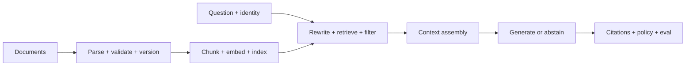
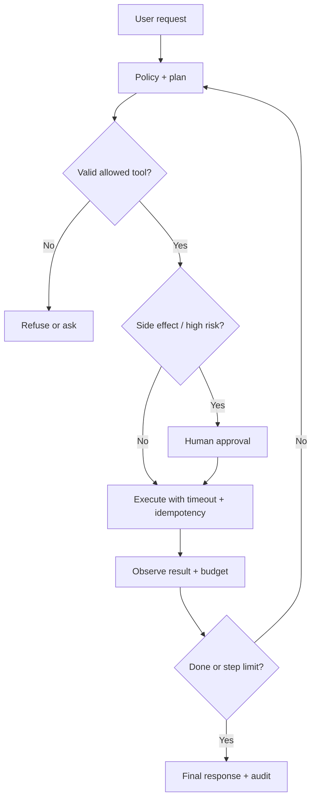

# Stage 3 — AI Engineering

**Weeks 11-16 · Exit outcome:** build a grounded, evaluated RAG and tool-calling workflow with explicit failure boundaries.

## Week 11: Measure model behavior

Learn the distinctions between:

- pretraining, instruction tuning, alignment, inference, and application orchestration;
- tokens, context windows, system/user/tool messages, and structured output;
- deterministic settings and residual non-determinism;
- quality, latency, throughput, rate limits, and cost;
- hallucination, omission, refusal, bias, and unsafe compliance.

### Controlled comparison

Create 30 representative tasks with expected properties. Run two candidate models or configurations three times each. Record:

- task success by category;
- schema validity and refusal correctness;
- p50/p95 latency;
- input/output tokens and estimated cost;
- variance across repeated runs;
- failure examples and customer impact.

Do not choose a model from a single impressive output.

## Week 12: Turn prompts into contracts

A production prompt contract contains:

1. task and authorized scope;
2. trusted context and untrusted data delimiters;
3. decision rules and precedence;
4. examples for hard boundaries, not decorative examples;
5. output schema and field semantics;
6. abstention, escalation, and unsafe-request behavior;
7. version, owner, evaluation dataset, and change history.

### Failure tests

Test prompt injection, conflicting context, missing evidence, impossible constraints, oversized input, malformed data, multilingual input, ambiguous intent, and output-schema pressure.

## Week 13: Embeddings and retrieval

### Retrieval experiment

1. Choose 50 realistic questions and label relevant source passages.
2. Create document identity, tenant, version, ACL, timestamp, and source metadata.
3. Compare two chunking strategies.
4. Measure recall@1, recall@5, MRR, latency, and zero-result rate.
5. Add metadata/ACL filters and prove cross-tenant recall is exactly zero.
6. Inspect failures by question type instead of tuning only the aggregate.
7. Decide whether hybrid search or reranking is justified by evidence.

The vector database is a retrieval component, not an authorization system. Enforce access before and during retrieval.

## Week 14: Build RAG as a pipeline

Instrument each stage separately. When an answer is wrong, classify it as:

- source missing or stale;
- parsing/chunking loss;
- relevant item not indexed;
- query mismatch;
- filter/authorization error;
- relevant item retrieved but ranked too low;
- context truncated or conflicting;
- model ignored or misused context;
- answer correct but citation invalid;
- policy should have caused abstention.

Complete [Lab 5](https://github.com/ashokmanohar-ai/-qe-to-forward-deployed-ai-engineer/tree/main/labs/05-rag-quality) and Portfolio Project 1.

## Week 15: Bound agents and tools

An agent is an application loop around model decisions, tools, state, and stop conditions. “Autonomous” is not a control.

For every tool define:

- purpose and owner;
- input/output schema and size limits;
- caller identity and authorization;
- read-only versus side-effecting behavior;
- timeout, retry, idempotency, and rate limit;
- data classification and logging policy;
- approval requirement;
- audit event and reversal path.

### Safe execution loop

Complete [Lab 6](https://github.com/ashokmanohar-ai/-qe-to-forward-deployed-ai-engineer/tree/main/labs/06-agent-tool-calling).

## Week 16: Evaluate the system

Use layered evaluation:

| Layer | Example measures |
|---|---|
| Deterministic | schema, citations, tool arguments, policy, latency, budget |
| Retrieval | recall@k, MRR, filter correctness, freshness |
| Generation | correctness, groundedness, completeness, relevance, tone |
| Agent | task success, invalid tool rate, steps, side effects, recovery |
| Safety | injection resistance, leakage, unsafe action, refusal correctness |
| Operations | availability, p95 latency, cost/success, fallback, drift |
| Human | expert preference, customer acceptance, escalation quality |

Segment by intent, risk, tenant, language, document age, and complexity. Establish release thresholds and critical tests that cannot be averaged away.

## Stage review

Demonstrate a RAG plus tool workflow on a versioned dataset. Show one retrieval failure, one generation failure, one unsafe tool proposal, and one latency regression. The evaluator must identify the failing layer and block a release when a critical threshold is missed.
